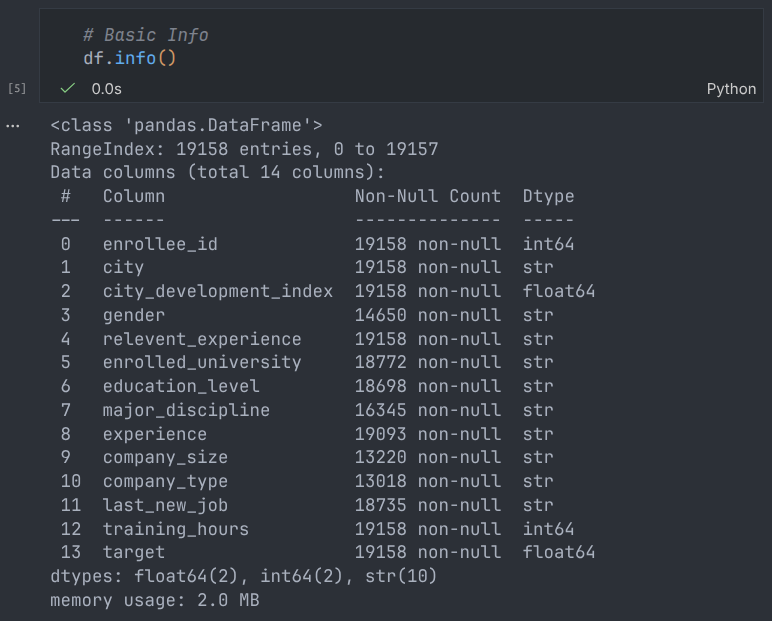
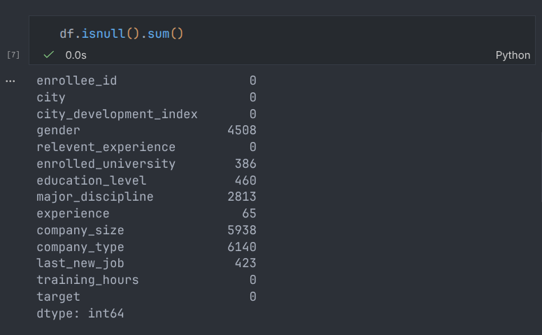
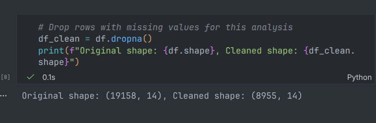
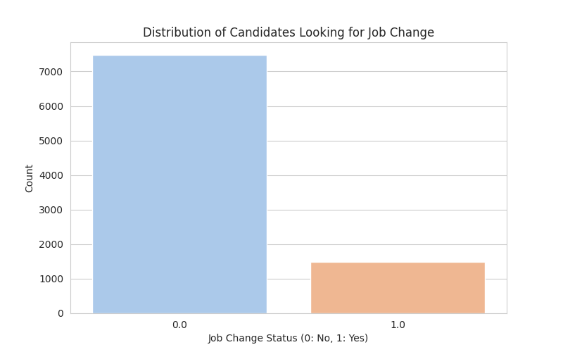
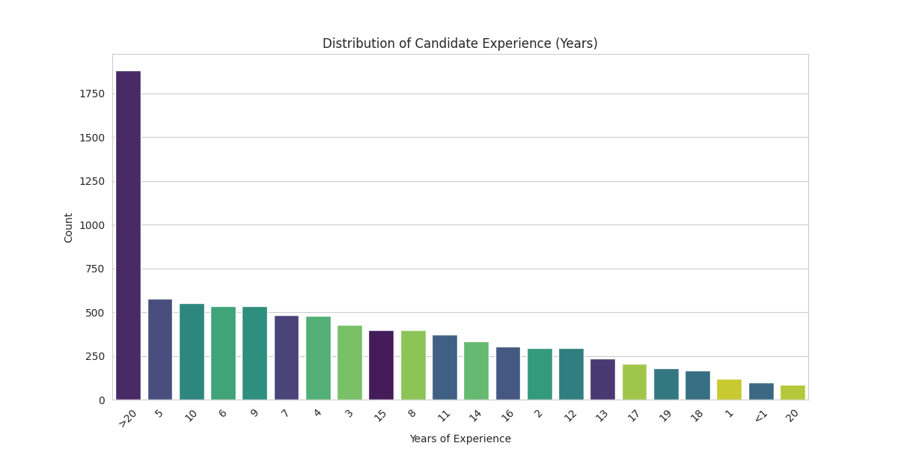
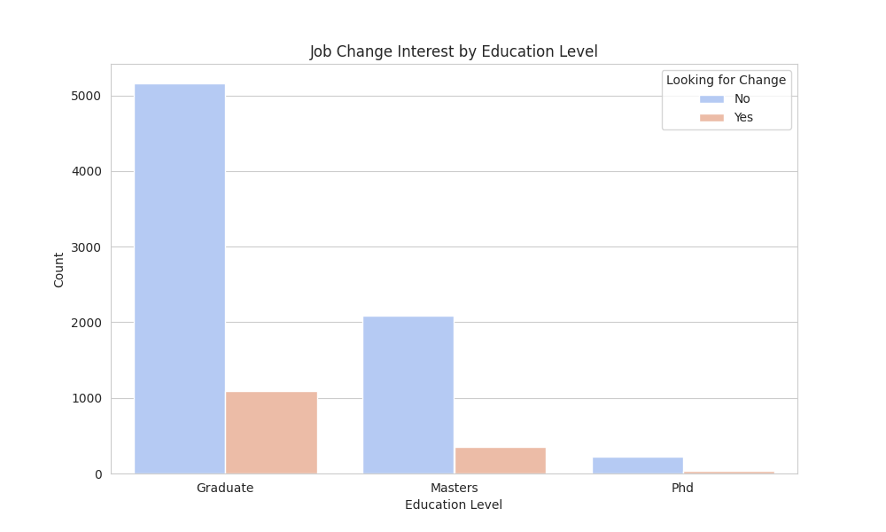
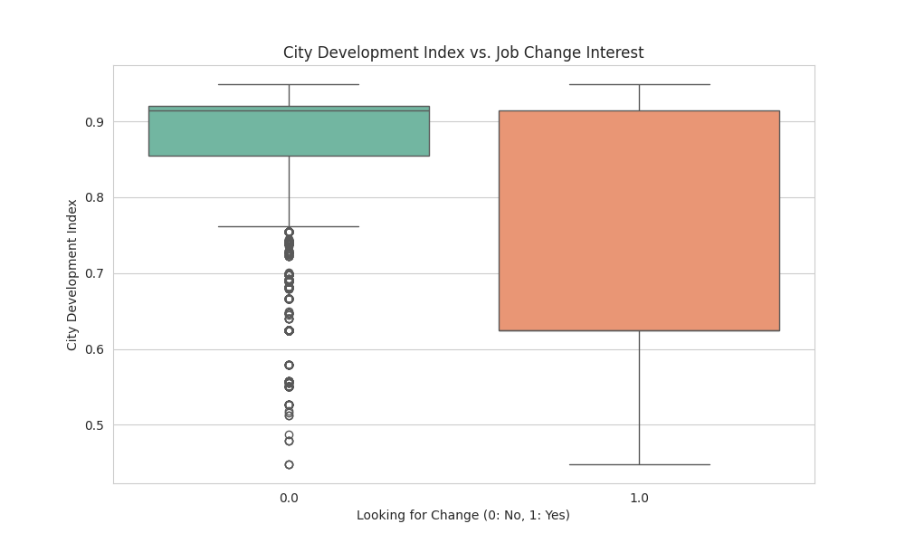
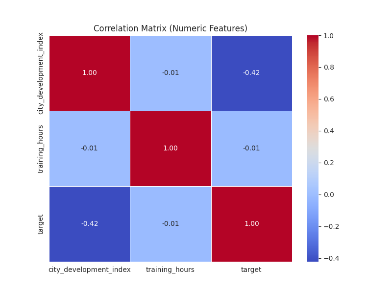

# HR Analytics: Job Change of Data Scientists Report

**Name:** Hansamal K.R.K
**Registration Number:** 2021/IS/034
**Index Number:** 21020345
**Dataset URL:** https://www.kaggle.com/datasets/arashnic/hr-analytics-job-change-of-data-scientists
**Github Repository URL:** https://github.com/kasunhansamal/bis-4116-assignment.git

---

## 1. Executive Summary
This report presents a comprehensive analysis of the "HR Analytics: Job Change of Data Scientists" dataset. The primary objective is to identify the factors that influence a data scientist's decision to leave their current job or look for new opportunities after completing training.

**Key Findings:**
- **City Development Index (CDI)** is the single strongest predictor of attrition. Candidates from cities with lower development indices are significantly more likely to seek new jobs, likely due to a desire for better infrastructure or standards of living.
- **Training Hours** have almost zero correlation with job-seeking behavior. This implies that offering more training hours alone is not an effective retention strategy.
- **Education Level** and **Experience** show distinct patterns, with STEM graduates showing specific tendencies toward job mobility.

---

## 2. Business Domain & Problem Statement

### 2.1 Context
A company specializing in Big Data and Data Science provides training courses to a large pool of candidates. The company wants to hire from this pool but faces a challenge: many candidates may not be looking for a job or might leave quickly.

### 2.2 Business Goal
The goal is to predict the **probability of a candidate looking for a new job** (`target = 1`) versus those who are not (`target = 0`). Understanding these drivers helps reduce recruitment costs and improve the quality of the hiring pipeline.

### 2.3 Dataset Overview
The dataset contains **19,158** records with features including:
- **Demographics:** City, Gender.
- **Education/Experience:** Education Level, Major, Experience (Years), Last New Job.
- **Current Employer:** Company Size, Company Type.
- **Training:** Training Hours.
- **Macro-Environment:** City Development Index (CDI).

---

## 3. Data Preprocessing & Cleaning

Before analysis, the data must be cleaned to ensure accuracy. This dataset contains a significant amount of missing information which must be addressed.

### 3.1 Loading and Inspection
We began by loading the dataset and inspecting the data types and structure.

*Figure 1: Output of `df.info()` showing column types and non-null counts.*

### 3.2 Handling Missing Values
A check for null values revealed significant gaps in columns like `company_type`, `company_size`, `gender`, and `major_discipline`.

*Figure 2: Output of `df.isnull().sum()` showing the count of missing values per column.*

**Cleaning Strategy:**
For this analysis, we adopted a strategy of **dropping rows with missing values** to ensure that our correlations and visualizations are based on complete, high-confidence data. While imputation is an option, dropping ensures we don't introduce bias into categorical variables like "Company Type".

*Figure 3: Output showing the shape of the dataframe before and after dropping NaNs.*

---

## 4. Exploratory Data Analysis (EDA)

### 4.1 Target Variable Distribution
The dataset is imbalanced. The majority of candidates are *not* looking for a job change.

*Figure 4: Distribution of Job Change Status (0 vs 1).*

### 4.2 Experience Levels
The candidate pool is diverse, ranging from fresh graduates (<1 year) to veterans (>20 years).

*Figure 5: Distribution of Experience (Years).*

---

## 5. Statistical Analysis & Visualization

### 5.1 Education Level Impact
We analyzed how education influences the desire to change jobs. Graduates appear to be the largest segment looking for changes, likely due to being early in their careers.

*Figure 6: Job Change Interest grouped by Education Level.*

### 5.2 The City Development Index (CDI) Factor
This was the most critical finding. We used a boxplot to compare the CDI of candidates looking for a change versus those who are not.

*Figure 7: Boxplot of City Development Index by Job Change Status.*

**Observation:**
- **Median CDI for Stayers (0):** High (~0.9).
- **Median CDI for Leavers (1):** Significantly lower.
- This indicates a strong environmental push factor: candidates in less developed cities want to move (likely to better cities or for better pay).

### 5.3 Correlation Matrix
We generated a heatmap to quantify relationships between numeric variables.

*Figure 8: Correlation Matrix of Numeric Features.*

**Key Statistical Correlations:**
- **CDI vs Target (-0.42):** A moderate-to-strong negative correlation. As CDI goes up, the "Target" (looking for a job) goes down.
- **Training Hours vs Target (-0.01):** Extremely weak correlation. There is no linear relationship between how much training a candidate receives and their intent to leave.

---

## 6. Detailed Interpretation & Conclusions

### 6.1 Interpretation of Results

1.  **The "Brain Drain" Phenomenon (CDI Impact):**
    The strong negative correlation between the City Development Index and the target variable is a classic indicator of economic migration. Candidates in cities with lower development indices (likely correlating with lower infrastructure, lower average salaries, or fewer local opportunities) are actively seeking new roles. Conversely, candidates in highly developed cities are more stable.

2.  **Training is a Hygiene Factor, Not a Motivator:**
    The lack of correlation between `training_hours` and `target` is profound. It suggests that while training is necessary for the job (hygiene factor), offering *more* of it does not increase loyalty. Candidates who complete 100 hours of training are just as likely to leave as those who complete 10.

3.  **Education and Mobility:**
    The analysis shows that candidates with "Graduate" level education are highly active in the job market. This often correlates with early-to-mid-career professionals seeking rapid advancement, whereas candidates with higher degrees (Ph.D.) or lower (Primary) might face different market dynamics or have higher stability.

### 6.2 Conclusions for the Business

*   **Recruitment Focus:** If the company wants to hire candidates who are *eager* to move, they should target cities with lower Development Indices. The acquisition cost might be lower, and the candidate interest higher.
*   **Retention Challenges:** Hiring from low CDI areas comes with a risk. If the job is remote or involves relocation to a high CDI city, retention might be high. However, if the job remains in a low CDI area, these employees will remain a "flight risk" as they continue to seek better environmental conditions.
*   **Training ROI:** The company should not expect training programs to serve as a retention tool. Training should be optimized for skill acquisition efficiency rather than duration, as longer training does not build loyalty.

### 6.3 Future Work
*   **Predictive Modeling:** The next step is to build a Logistic Regression or Random Forest model to predict the probability of `target=1` for new applicants.
*   **Imputation:** Future analysis could use advanced imputation (e.g., KNN) for missing values instead of dropping them, to preserve more data points.

